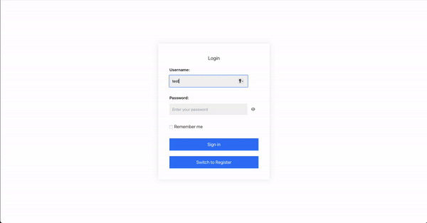

# Backoffice WebApp


<p align="center">
  
</p>

## About
This repository contains the codebase for a Backoffice Web Application designed for managing various administrative tasks for an e-commerce. The project is structured into backend and frontend components. It uses React for the frontend and Flask for the backend. Data is stored using SQLAlchemy for database interactions with SQLite.

### Features

- **Backend**: Implemented in Python
  - Provides APIs for data management and processing
  - Uses JWT for secure authentication
  - Handles CORS for cross-origin requests
  - Uses Axios for HTTP API calls
  - Uses Tanstack for table management
- **Frontend**: Built with TypeScript and JavaScript
  - User interface for interacting with the backend services
- **Styling**: Uses Tailwind CSS for styling components

### Pages

The frontend consists of the following pages:

- **Dashboard**: Provides an overview of key metrics and various reports generated from the data.
- **Product Table**: Allows administrators to create, read, update, and delete Products.
- **Category Table**: Allows administrators to create, read, update, and delete Categories.
- **Customer Table**: Allows administrators to create, read, update, and delete PrCustomersoducts.

## Requirements

- **Python**: 3.12.3
- **Flask**: 3.0.3
- **npm**: 10.7.0
- **React**: 18.3.1


## Project Structure

- `/backend`: Contains the backend code in Flask.
- `/frontend`: Contains the frontend code in React.

## Installation

Follow these steps to install and run the application.

### Backend

1. Clone the repository:
    ```bash
    git clone https://github.com/GuglielmoCerri/Backoffice-WebApp.git
    cd Backoffice-WebApp/backend
    ```

2. Create and activate a virtual environment:
    ```bash
    python -m venv venv
    source venv/bin/activate  # On Windows use `venv\Scripts\activate`
    ```

3. Install dependencies:
    ```bash
    pip3 install -r requirements.txt
    ```

4. Create a .env file in the backend directory with the following content:
    ```text
    SQLALCHEMY_DATABASE_URI=sqlite:///app.db
    JWT_SECRET_KEY=Test
    ```
    You can replace YourSecretKey with your own JWT secret key for enhanced security.

5. Initialize the database:
    ```bash
    python3 init_db.py
    ```

6. (Optional) Populate the database with fake data:
    ```bash
    python3 populate_db.py
    ```

7. Run the Flask server:
    ```bash
    flask run
    ```

### Frontend

1. Navigate to the frontend folder:
    ```bash
    cd ../frontend
    ```

2. Install dependencies:
    ```bash
    npm install
    ```

3. Start the development server:
    ```bash
    npm start
    ```

## Usage

1. Ensure the Flask backend is running:
    ```bash
    cd backend
    flask run
    ```

2. In a new terminal window, navigate to the frontend folder and start the development server:
    ```bash
    cd frontend
    npm start
    ```

The application will be available at `http://localhost:3000`.

## Contributions

Contributions are welcome! Please open an issue or a pull request for improvements and bug fixes.

## License

This project is licensed under the [MIT License](LICENSE).
